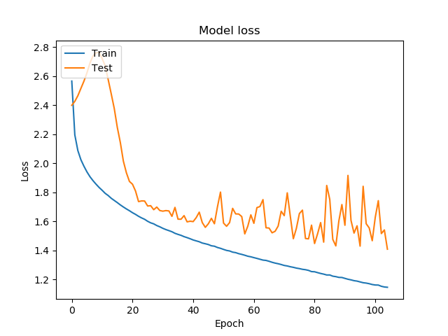
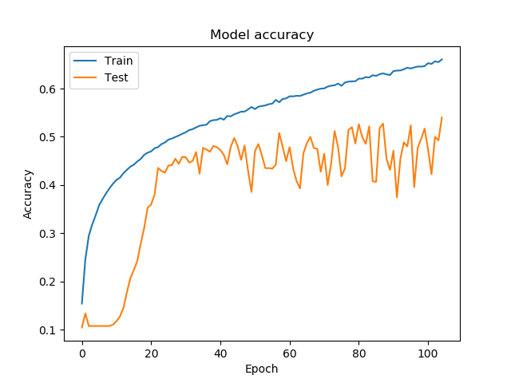
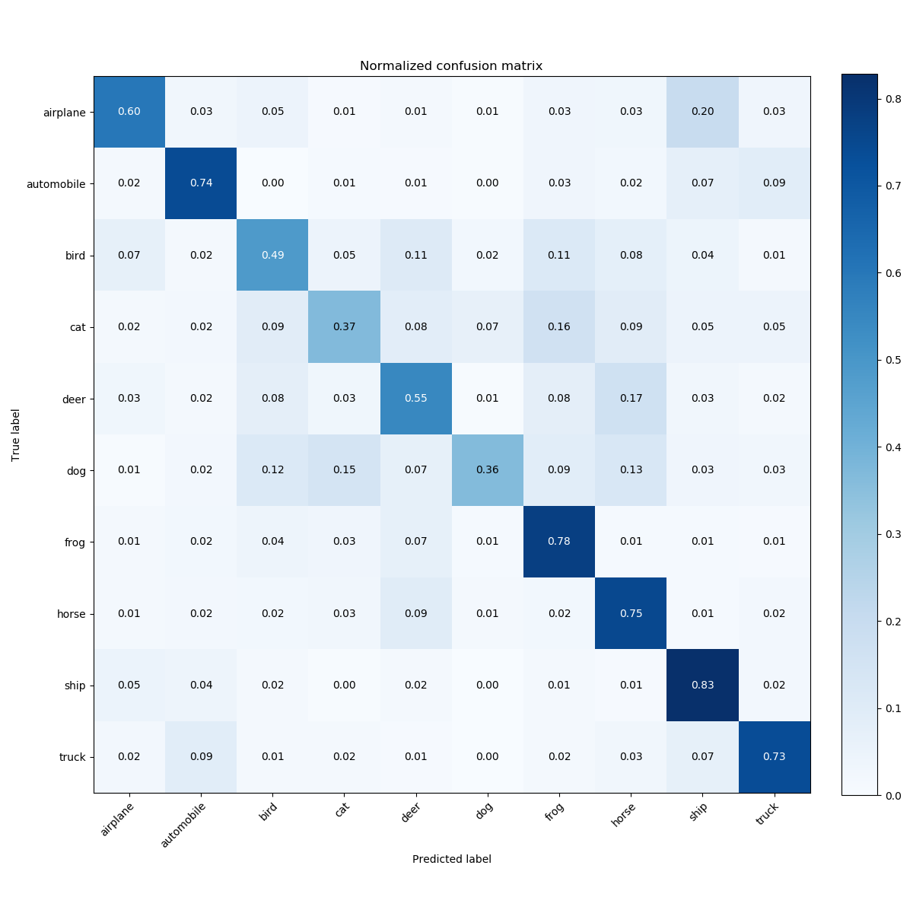

# tensorflow-dataset-examples
Examples to show how to use Tensorflow Dataset API (tf.data.Dataset)

# Data:
* CIFAR10: https://www.cs.toronto.edu/~kriz/cifar.html

# Loss

# Accuracy

# Confusion matrix

# TODO:
* tf.data.Dataset
* improve performance
